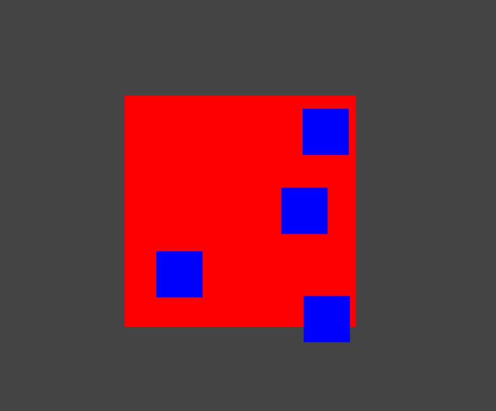

Now that our tree is created in `apple-tv.html`, we have a structure where we can attach behaviors. Let's build out our main component file `apple-tv.js` by importing our tree and defining some new behaviors.

##  The Framework component

Since we will start rebuilding our component from the ground up, let's replace everything currently in `apple-tv.js` with snippet below.

                             //    ↓ path to your project
    FamousFramework.component('my-name:apple-tv', {
	    behaviors: {},          // ← all of our behaviors go here
	    events: {},              // ← all of our events go here 
	    states: {},               // ← our states will go here
	    tree: 'apple-tv.html'  // ← we reference our tree here
	  })
	
Here, we've labeled an empty framework component and added a reference to our tree: `apple-tv.html`. Simply adding a string reference to the file will import the tree into our Framework component. 

As you follow along, we will fill out the other module _facets_ ( `behaviors`, `events`, and `states` ) within the `apple-tv.js` file. Instead of including the entire component in every snippet, we will simply list the facet objects (sometimes only part of them) for brevity. Note that any facet can be broken into its own file and imported similar to the tree above. 

## Adding Behaviors

Let's add some behaviors to our tree so we can visualize what we created in the last section. Replace the behaviors in the snippet above with the behaviors object below. Don't forget to include a comma after your new behavior when switching it out.

		behaviors: {
	        '#root':{
	            'style':{  // make the backgound grey
	                'background-color':'grey',
	                'perspective': '1000px'
	            }
	        },
	        '#rotator-node': {
	            'size': [500, 500],          // size as 500px by 500px
	            'align': [0.5,0.5],          //center align to window
	            'mount-point':[0.5,0.5],     // center self 
	            'style': {
	                'background': 'red'
	            }
	        },
	        '.gallery-item':{
	            'size': [100,100],   // 100px by 100px
	            'style':{
	                'background-color': 'blue'
	            },
	            '$repeat':function(){
	                return [1,2,3,4]   // ← repeat over array
	            },
	           'position': function($index){  // call this for each item   
	                return [Math.random()*500, Math.random()*500]
	            }
	        }
	    }
		
Within behaviors, we use CSS-like selectors to target the nodes in our tree. Focus on the `$repeat` control flow statement above. A new node is created for each item in the array it returns (`[1,2,3,4]` or four nodes in total ). Then, by adding `$index` to any behavior function, we tell the framework to call that function for each item in that array. 

If you haven't done so already, run `npm run dev` to see the changes above on [localhost:1618](http://localhost:1618). The output should look similar to the image below.

The code above positions 4 nodes (blue square) randomly within the `#rotator-node` (red square). If you were to remove the `$index` from the behavior function, you'd find your four nodes randomly positioned, but stacked on top of each other.

In the next section, we will add some stateful values that we can use to drive our behaviors and eventually create our animations. 

[Up next: Adding state &raquo;](./adding-state.html)

